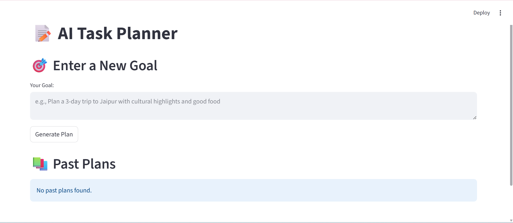
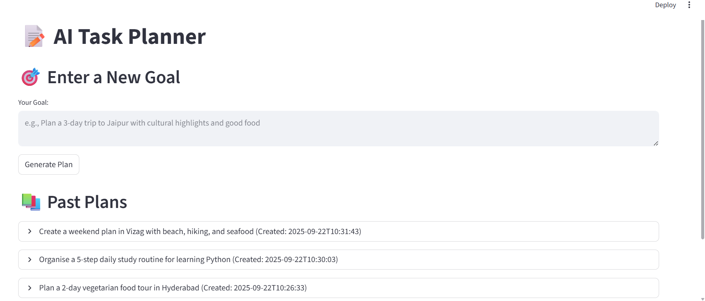
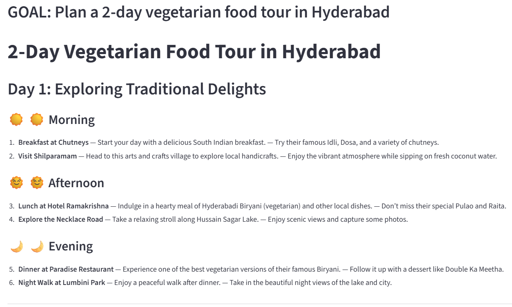
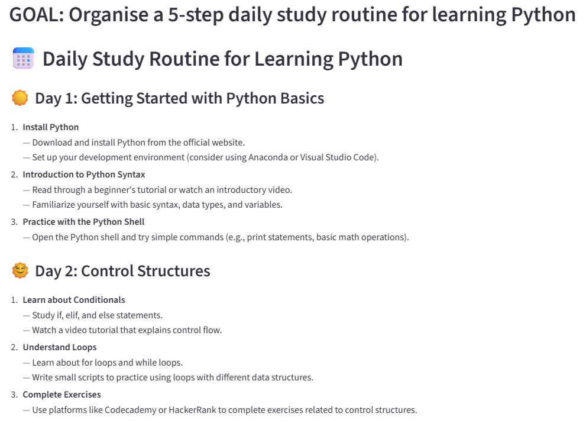

# 🗺️ AI Task & Trip Planner

AI Task Planner is a lightweight agent that helps turn natural language goals into clear, actionable day-by-day plans.  It enriches your tasks with external data like weather forecasts and web search results, making the plans context-aware.  Each generated plan is saved into a database for easy revisiting.  The app provides a simple Streamlit web interface to create, view, and download plans as PDF reports.

---

## 🚀 Features
- Accepts natural language goals (e.g., *“Plan a 3-day trip to Jaipur with cultural highlights and good food”*).
- Breaks down goals into **day-by-day structured steps** (Morning, Afternoon, Evening).
- Enriches plans with:
  - 🌦 **Weather info** (if a city/location is detected).
  - 🔍 **Web search results** for relevant context.
- Saves every plan in a **SQLite database**.
- View and download plans as **PDF reports**.
- Browse your **history of past plans**.

---

## ⚙️ How it Works

### Workflow
1. **Input**: User enters a goal (e.g., *"Plan a 2-day vegetarian food tour in Hyderabad"*).
2. **Planner**:  
   - LLM breaks it down into actionable steps.  
   - **Tavily API** enriches with web results.  
   - **OpenWeather API** adds weather context if location is detected.  
3. **Storage**: Goal + plan saved in SQLite database.  
4. **UI**: Streamlit web app to view current + past plans.

---
## 🧩 Project Structure
   ```bash
   AI_Task_Planner/
   │── app.py                 # Streamlit web app
   │── planner.py             # Planner + APIs
   │── db.py                  # Database helpers
   │── requirements.txt       # Dependencies
   │── README.md              # Project documentation
   │── .env                   # Example environment variables
   └── samples/               # Folder for sample output files
```
---

###   Architecture Diagram

```text
┌──────────────┐     ┌──────────────┐     ┌──────────────┐     ┌──────────────┐     ┌──────────────┐
│  User Goal   │ ──> │   Planner    │ ──> │ Web Search & │ ──> │   Database   │ ──> │ Streamlit UI │
│              │     │ (LLM + tools)│     │   Weather    │     │   (SQLite)   │     │              │
└──────────────┘     └──────────────┘     └──────────────┘     └──────────────┘     └──────────────┘
```
---

## ⚙️ Setup Instructions

1. **Clone the repo**
   ```bash
   git clone https://github.com/M27113/AI_Task_Planner.git
   cd AI_Task_Planner
   
2. **Create and activate virtual environment**
    ```bash
    python -m venv venv
   source venv/bin/activate   # Mac/Linux
   venv\Scripts\activate      # Windows

3. **Install dependencies**
   ```bash
   pip install -r requirements.txt

4. **Download spaCy English model**

    This is required for city/state/country extraction in plans:
    ```bash
    python -m spacy download en_core_web_sm
    
4. **Add Environment Variables**

   Create a .env file in project root:
   ```bash
   OPENAI_API_KEY=your_openai_key
   TAVILY_API_KEY=your_tavily_key
   OPENWEATHER_API_KEY=your_openweather_key

5. **Run App**

   ```bash
   streamlit run app.py

## 🎨 Streamlit Interface

After you successfully set up the app, your Streamlit interface should look like this:

1. Without any prior goal entries



2. After few goal entries
   


## 📝 Sample Goals & Plans  

Here’s few sample input and the generated streamlit output and PDF output:  

**Input Goal:**  

1. *"Plan a 2‑day vegetarian food tour in Hyderabad"*

   **Generated Output (streamlit) :**
   
   

   **Generated Output (PDF) :**   [Download_Sample_Plan1](./samples/sample_plan1.pdf) 

2. *"Organise a 5‑step daily study routine for learning Python"*
 
   **Generated Output (streamlit) :**
   
   

   **Generated Output (PDF) :**   [Download_Sample_Plan2](./samples/sample_plan2.pdf)

3. *"Create a weekend plan in Vizag with beach, hiking, and seafood"*
 
   **Generated Output (streamlit) :**
   
   

   **Generated Output (PDF) :**   [Download_Sample_Plan3](./samples/sample_plan2.pdf)


